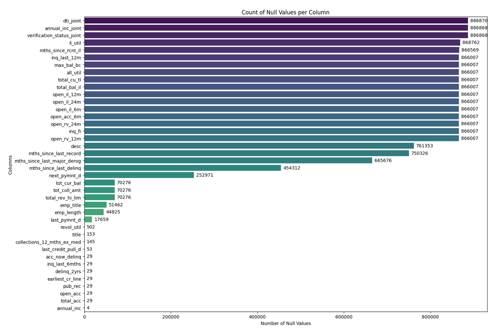

# End-to-End Loan Default Prediction System 


## Overview 

Lending Club is a peer-to-peer Lending company based in the US. They match people looking to invest money with people looking to borrow money. When investors invest their money through Lending Club, this money is passed onto borrowers, and when borrowers pay their loans back, the capital plus the interest passes on back to the investors. It is a win for everybody as they can get typically lower loan rates and higher investor returns. 

## Use Cases 

## Folder Structure 

## Project Workflow 

## Dataset 

The project based on a scaled down [Dataset](https://www.kaggle.com/datasets/janiobachmann/lending-club-first-dataset). The [Lending Club original dataset](https://www.kaggle.com/datasets/adarshsng/lending-club-loan-data-csv/data) contains complete loan data for all loans issued through the 2007-2015, including the current loan status (Current, Late, Fully Paid, etc.) and latest payment information. Features (aka variables) include credit scores, number of finance inquiries, address including zip codes and state, and collections among others. Collections indicates whether the customer has missed one or more payments and the team is trying to recover their money. The file is a matrix of about 890 thousand observations and 75 variables. 

| Feature Group                     | Columns                                                                                                                                         | Data Type                    | Description                                                                                 |
| --------------------------------- | ----------------------------------------------------------------------------------------------------------------------------------------------- | ---------------------------- | ------------------------------------------------------------------------------------------- |
| **Loan Identification**           | id, member_id, url, policy_code, initial_list_status                                                                                            | Integer, String, Categorical | Unique identifiers and platform information about the loan listing                          |
| **Loan Information**              | loan_amnt, funded_amnt, funded_amnt_inv, term, int_rate, installment, grade, sub_grade, loan_status                                             | Numeric, Categorical         | Core loan details including amount, term, interest rate, installment and loan status        |
| **Borrower Personal Information** | emp_title, emp_length, home_ownership, zip_code, addr_state                                                                                     | String, Categorical          | Borrower's employment details and residential information                                   |
| **Income & Verification**         | annual_inc, verification_status, annual_inc_joint, verification_status_joint, application_type                                                  | Numeric, Categorical         | Borrower income details and whether income was verified                                     |
| **Loan Purpose Information**      | purpose, title, desc                                                                                                                            | Categorical, String, Text    | Borrower-stated purpose and description of the loan                                         |
| **Credit Profile**                | dti, dti_joint, earliest_cr_line, total_acc, open_acc, pub_rec, revol_bal, revol_util                                                           | Numeric, Integer, Date       | Borrower credit history including debt-to-income ratio, credit lines and revolving balances |
| **Credit History & Delinquency**  | delinq_2yrs, mths_since_last_delinq, mths_since_last_record, acc_now_delinq, collections_12_mths_ex_med, mths_since_last_major_derog            | Integer, Numeric             | Indicators of borrower delinquency and derogatory credit events                             |
| **Credit Inquiry Activity**       | inq_last_6mths, inq_last_12m, inq_fi                                                                                                            | Integer                      | Number of credit inquiries within recent time periods                                       |
| **Revolving Credit Activity**     | open_rv_12m, open_rv_24m, max_bal_bc, total_rev_hi_lim                                                                                          | Integer, Numeric             | Revolving credit account activity and credit limits                                         |
| **Installment Account Activity**  | open_il_6m, open_il_12m, open_il_24m, total_bal_il, il_util, mths_since_rcnt_il                                                                 | Integer, Numeric             | Installment loan activity and installment credit utilization                                |
| **Account Balance Metrics**       | tot_cur_bal, tot_coll_amt, all_util, total_cu_tl                                                                                                | Numeric, Integer             | Overall credit balances, collections and financial trade counts                             |
| **Payment & Loan Performance**    | out_prncp, out_prncp_inv, total_pymnt, total_pymnt_inv, total_rec_prncp, total_rec_int, total_rec_late_fee, recoveries, collection_recovery_fee | Numeric                      | Payment performance and recovery amounts                                                    |
| **Date Features**                 | issue_d, last_pymnt_d, next_pymnt_d, last_credit_pull_d                                                                                         | Date                         | Important loan timeline events                                                              |
| **Recent Account Activity**       | open_acc_6m                                                                                                                                     | Integer                      | Number of credit accounts opened recently                                                   | 

 

## Data Cleaning 

Keep features: 

`loan_amnt` `term` `int_rate` `installment` `grade` `sub_grade` `annual_inc` `verification_status` 

`dti` `earliest_cr_line` `open_acc` `total_acc` `revol_bal` `revol_util` `all_util` `delinq_2yrs` 

`acc_now_delinq` `mths_since_last_delinq` `pub_rec` `collections_12_mths_ex_med` `inq_last_6mths` 

`inq_last_12m` `tot_cur_bal` `total_rev_hi_lim` `home_ownership` `addr_state` `emp_length` `purpose` 

Target: `loan_status` 

## Feature Engineering 

## Exploratory Data Analysis 

## Note 

`grade` will not be used for training. But, input will be taked in deployment. Upon selection, sub_grade will be filetered (for example, if A is selected for grade, users can choose from A1 to A5 instead of A1 to G5). 

`region` field will be created during feature engineering section. In deployment, `addr_state` will be filtered according to `region` selection. 

| Region          | Count  |
| --------------- | ------ |
| West            | **11** |
| South           | 14     |
| North           | 8      |
| Central         | 12     |
| East            | 4      |
| Out of Mainland | 2      | 

```bash
region_map = {

# WEST
'CA':'West','OR':'West','WA':'West','NV':'West','AZ':'West','UT':'West','ID':'West',

# SOUTH
'TX':'South','FL':'South','GA':'South','NC':'South','SC':'South','VA':'South',
'TN':'South','AL':'South','MS':'South','LA':'South','AR':'South','OK':'South',
'KY':'South','WV':'South',

# NORTH
'NY':'North','NJ':'North','MA':'North','CT':'North','RI':'North',
'VT':'North','NH':'North','ME':'North',

# CENTRAL
'IL':'Central','MO':'Central','MN':'Central','WI':'Central','MI':'Central',
'IA':'Central','KS':'Central','NE':'Central','SD':'Central','ND':'Central',
'IN':'Central','OH':'Central',

# EAST
'PA':'East','MD':'East','DE':'East','DC':'East',

# OUT OF MAINLAND
'AK':'Out_Mainland','HI':'Out_Mainland'
}
```

```bash
df['region'] = df['addr_state'].map(region_map).fillna('Unknown')
```


